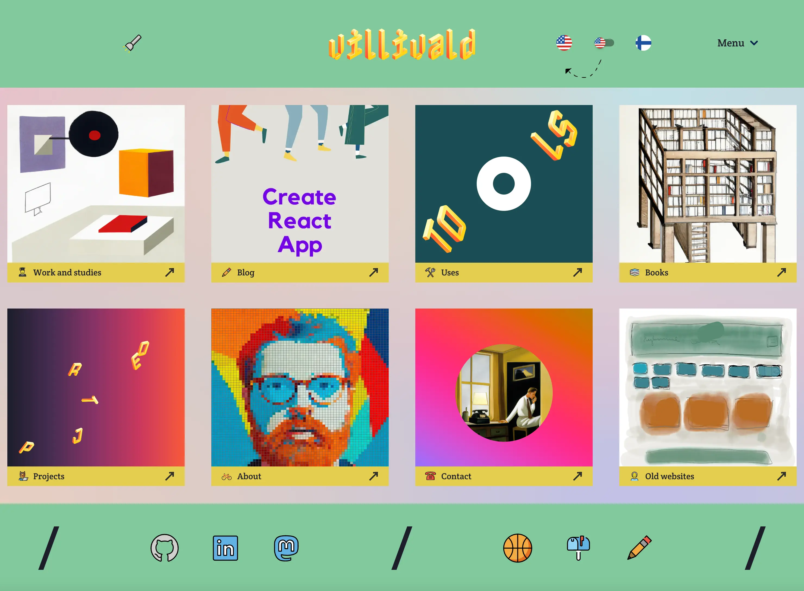
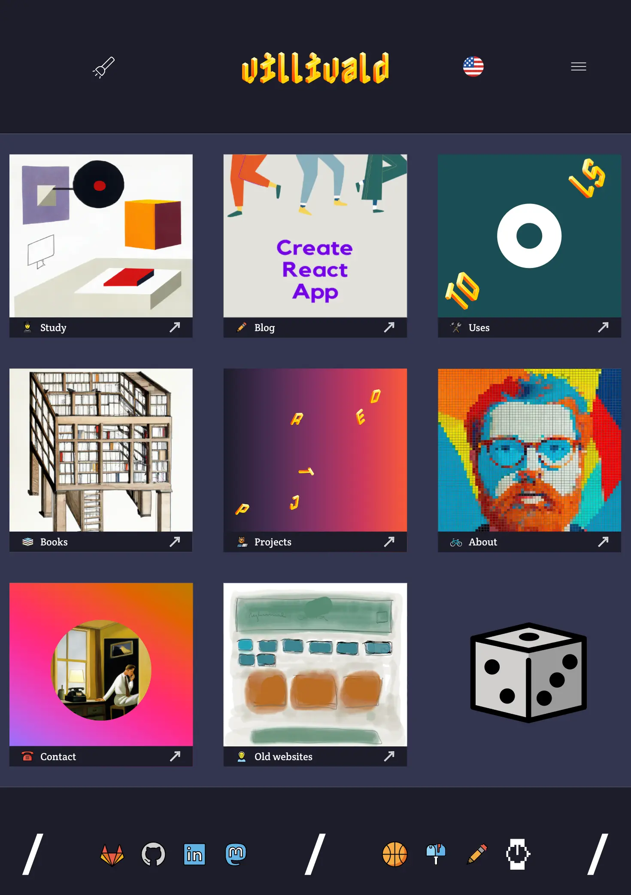
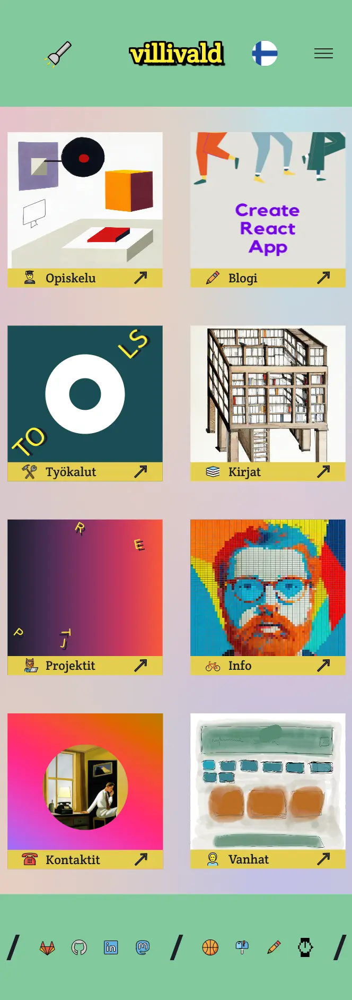

<h1 align="center">Welcome to my personal website - <a href="https://villivald.com">villivald.com</a> 👋</h1>

  
  
  
  
  
  
  
  
  
  

## Built With

- [Next.js](https://nextjs.org/)
- [TypeScript](https://www.typescriptlang.org/)
- [OpenMoji](https://openmoji.org/)
- [Atropos.js](https://atroposjs.com/)
- [Chart.js](https://www.chartjs.org/)
- [React Virtuoso](https://virtuoso.dev/)
- [FormatJS](https://formatjs.io/)

## Screenshots

  

  

  

## Author

👤 **[villivald](https://github.com/villivald)**

- Website: https://villivald.com/
- Blog: https://create-react-app.com/
- Mastodon: [@villivald](https://notacult.social/@villivald)
- LinkedIn: [@villivald](https://linkedin.com/in/villivald)

## 🤝 Contributing

Contributions, issues and feature requests are welcome! Feel free to check [issues page](https://github.com/villivald/proj_react_2020/issues).

## Show your support

Give a ⭐️ if this project helped you!
